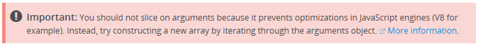

+++
categories = ["tools"]
date = "2015-11-19T11:23:49+01:00"
title = "Hugo and image inclusion does not work out of the box"
+++

Adding an image into a blog post should be as simple as:

```markdown

```

At least, this works great while editing the post in an
editor with active Markdown preview (such as Atom, the preview
is activated by pressing Ctrl+Shift+M).

However, Hugo was not happy with that image reference. The generated
HTML ended up in `2015/11/blah/index.html` whereas the image was copied
to `post/do-not-slice.png`.

This was caused by the settings I was using. To have images copied
alongside the generated content, I had to:

* Remove my `[permalinks]` section which contained `post = "/:year/:month/:filename/"`
* Add `uglyurls = true`.
* Organize manually my posts by year and month in the source tree.

I [commented on issue 1199](https://github.com/spf13/hugo/issues/1199)
hoping that this behavior would get fixed. Or at least to have the
issue being reopened.
