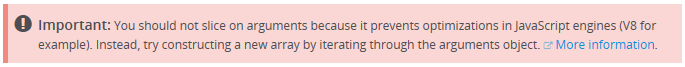

+++
categories = ["js"]
date = "2015-11-19T10:39:00+01:00"
title = "Don't slice your arguments"
+++

I needed to join a function's arguments using `array.join()` and
I remembered that I could not simply call `join()` on the
`arguments` object, as it is not a real array.

Internet wisdom has it that `arguments` can be changed into an
`Array` by this code snippet:

```javascript
const args = Array.prototype.slice.call (arguments);
```

## Slicing can cost much more than expected

It came as a surprise to me, when I found this warning in the
[MDN documentation](https://developer.mozilla.org/en-US/docs/Web/JavaScript/Reference/Functions/arguments)
for `arguments`:



The JavaScript interpreter in modern browsers is doing lots of optimizations,
which are turned off if `arguments` is **leaked** outside of a function.

Leaking `arguments` happens in following cases:

* When the function returns `arguments`.
* When the function passes `arguments` to another function (such as `call()`
  in the classic `Array.prototype.slice.call(arguments)`).
* When `arguments` get captured in a closure.

See [Petka Antonov's explanation](https://github.com/petkaantonov/bluebird/wiki/Optimization-killers#32-leaking-arguments).

## Workaround

The solution is to create an array with the expected size, and then copy
one item after the other.

Here is a working example:

```javascript
const args = new Array (arguments.length);
for (var i = 0; i < args.length; ++i) {
  args[i] = arguments[i];
}
```

and obviously, you should not extract this piece of code when doing
some refactoring, as you'd end up with _leaking_ again, defeating the
purpose of this code snippet.

> EDIT: see [this follow-up post](javascript-will-not-listen-to-your-arguments.html)
> for the idiomatic ES2015 way of writing equivalent code.
