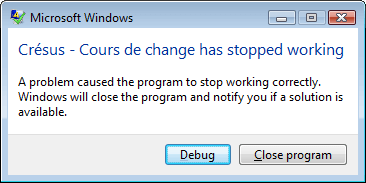

+++
categories = ["Debugging", "Win32"]
date = "2015-12-04T16:52:58+01:00"
title = "MFC Win32 app silently dies"
+++

Today has been my first excursion back into C++ and MFC for years.  
Ah, _memories_.

I was trying out Michael's application on my machine, but I could
not get it to display its initial window. On Michael's PC everything
worked, of course. I first supposed that there could be some missing
files, that explained why it worked on Michael's and not on mine.

This was quickly ruled out by trying the application on a clean VM.

* Clean Windows 8 machine? OK.
* Clean Windows 7 machine? OK.

Then on an old, battle scarred VM running Vista, I had a nice crash
with an error dialog. And the much expected dialog popped open:



I hoped that the _Debug_ button would help me discover the cause
of this crash. But the Visual Studio 2008 version which opened in
that VM just showed an already dead process:

> The thread 'Win32 Thread' (0x12c8) has exited with code 0 (0x0).  
> The program '[3148] coursch2.exe: Native' has exited with code 3 (0x3).

That was the WTF moment...

# Building from source helps...

I called Michael. He suggested that I clone the sources and that I
try a build on my main machine, since I had the issue there too...

Open solution, selection startup project, F5. Bam. The debugger points
directly deep into MFC:

```javascript
void CSingleDocTemplate::SetDefaultTitle(CDocument* pDocument)
{
  CString strDocName;
  if (!GetDocString(strDocName, CDocTemplate::docName) ||
    strDocName.IsEmpty())
  {
    // use generic 'untitled'
    ENSURE(strDocName.LoadString(AFX_IDS_UNTITLED));
  }
  pDocument->SetTitle(strDocName);
}
```

Do you see that `ENSURE` right there? It will throw an exception and
kill your process in no time if the program fails to load the string.
Huh?

It started to smell like some rotten _localization issue_.

Apparently, we are not alone as [this old post from 2009](https://social.msdn.microsoft.com/Forums/en-US/93b4bd2a-9486-4fe3-a0a2-3001375e642c/invalid-arg-exception-in-vs2008-when-loading-afxidsuntitled-to-set-the-default-title?forum=vcgeneral)
proves.

The symbol `AFX_IDS_UNTITLED` (which resolves to `61443` or
`0xF003`) could not be found on my machine, but on Michael's it
resolved to a valid string. Because I am working with an English
UI and Michael is working with a French UI. And the program has
only French resources.

We did not find the reason of why it works on the French systems,
but not on English ones. There must be some tricks played on us by
evil Windows fall-back mechanisms which do (or do not) find resources
in MFC. Even when it is statically linked, like it is in our case.

# Working around the problem

We just added a resource in the program's _String Table_, as:

```javascript
AFX_IDS_UNTITLED  61443  Sans titre
```

# Post Scriptum

Now, why did the program work on my clean VMs?

At first, I supposed that they were also running a French version
of Windows. But no, both proved to be English installations.

The only apparent difference was the date format:

* On my machine, it read **17:20 04.12.2015**
* On the VMs it read **5:20 PM 12/4/2015**

Changing the _Region and Language_ used by the system to a
_Format_ set to _French (Switzerland)_ triggered the crash.

As soon as the English VMs started working with a locale set
to French (Switzerland), the application consistently crashed
on startup. And to make things more interesting, if I try another
French locale, such as _French (Canada)_, everything just works.

Only when the locale is set to the same setting as the `LANGUAGE`
directive in the `*.rc` file does the issue arise:

> `LANGUAGE LANG_FRENCH, SUBLANG_FRENCH_SWISS`

Maybe _nobugz_ [Hans Passant](https://social.msdn.microsoft.com/profile/nobugz/activity)
has an explanation for this behavior. I'd be curious to know why
the resolution of `AFX_IDS_UNTITLED` succeeds when the locale is
not identical to the setting in the `*.rc` file.
