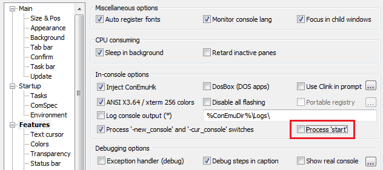

+++
categories = ["tools"]
date = "2016-03-03T13:08:40+01:00"
title = "Cmder and command start behavior"
+++

I have been struggling with `cmd` scripts for a while. Here is what the script
does:

* It does some preliminary configuration and setup.
* It starts `nuget -restore`.
* It starts `msbuild` to produce binairies from a solution.
* It copies the binaries to some target folder with `robocopy`.

I need all steps to be executed sequentially, so I systematically `call`
into child batch files and `start /wait` executables. Nevertheless, I found
out that `msbuild` started to run before `nuget` was done, and `robocopy`
would try to copy the binaries just after `msbuild` started.

## Why is start /wait not waiting?
 
I struggled with my scripts, trying to find what was wrong with them.
Until I discovered that [Cmder](http://cmder.net/), the wonderful console
emulator I am running my script in, has a feature which interfers with
how `start` works:

The option _Process 'start'_ must be turned off, or else the new processes
will start in new ConEmu tabs, and **this breaks waiting**.

> Hook 'start' command in your cmd's prompt and batches started
> in ConEmu tabs to run console applications in new ConEmu tabs.

This has been [documented](https://github.com/Maximus5/ConEmu/issues/420)
in the ConEmu issue [#420](https://github.com/Maximus5/ConEmu/issues/420).
