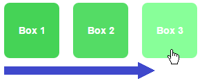

+++
categories = ["css"]
date = "2016-05-19T14:21:22+02:00"
title = "Asymetric transitions in CSS"
+++

CSS3 is great at animating web content. While developing the `electrum-arc`
collection of web components, Daniel Roux started to experiment with some
simple CSS transitions, in order to provide a smooth _transition_ between
display states of active elements (e.g. **normal** &rarr; **hover** &rarr;
**normal** for a button).

There are many excellent resources on the web for those who start playing
with CSS transitions and animations (let me point you to [Shay Howe's
excellent introduction to transitions and animations](http://learn.shayhowe.com/advanced-html-css/transitions-animations/)
and Val Head's book [CSS animations](http://valhead.com/book/) pocket
guide published by Five Simple Steps).

# Basic example of a button transition

Let's have a look at a simple transition effect applied to animate the
`background` color property of a `<div class="box">` element:

```CSS
.box {
  background: #22bb33; // dark green
  transition-property: background;
  transition-duration: 2s;
  transition-timing-function: ease-out;
}

.box:hover {
  background: #88ff99; // light green
}
```

Whenever the mouse enters the element, the color progressively changes
from **dark green** to **light green**. The whole transition takes 2 seconds.
And when the mouse leaves the element, the color returns to dark green,
again using the same transition parameters (also 2 seconds).

But what if we want a quick animation when the mouse enters, and a slow
fading animation when the mouse exists the button?

# Asymetric transitions

I first thought of using some JavaScript to listen for the `focus` and
`blur` events and changing the transition properties on the fly, by
code. But this is not elegant, and CSS3 provides a better way to do
exactly this without a single line of code.

Let's recap what the example above tells the browser's rendering engine
to do:

* When applying the `.box` style, use dark green and transition the
  color in 2 seconds, using the ease out timing function.
* When applying the `.box:hover` style, use light green and **inherit
  all other properties** from `.box`.
  
So `.box:hover`includes the properties for transitioning the color in
2 seconds, using the ease out timing function.

Whenever the mouse enters the button, the `.box:hover` style gets active
immediately, and the properties get transitioned according to what
has been defined by the `transition-...` properties.

So, if we change `.box:hover` to include its own `transition-duration`
to, say, `0.1s` we will see a very quick transition when `.box:hover`
becomes active. And the slow, 2 second transition when returing to
the `.box` style.



## Source code

And here is the source of an example which shows a quick transition
from normal &rarr; hover and a slow transition back from
hover &rarr; normal.

### CSS

```css
.box {
  background: #22bb33;
  border-radius: 8px;
  cursor: pointer;
  height: 80px;
  line-height: 80px;
  text-align: center;
  transition-property: background;
  transition-duration: 2s;
  transition-timing-function: ease-out;
  width: 80px;
  margin-right: 20px;
}

.box:hover {
  background: #88ff99;
  transition-property: background;
  transition-duration: .1s;
  transition-timing-function: ease-out;
}

.container {
  display: flex;
}
```

### HTML

```html
<body>
  <div class="container">
    <div class="box">Box 1</div>
    <div class="box">Box 2</div>
    <div class="box">Box 3</div>
  </div>
</body>
```
