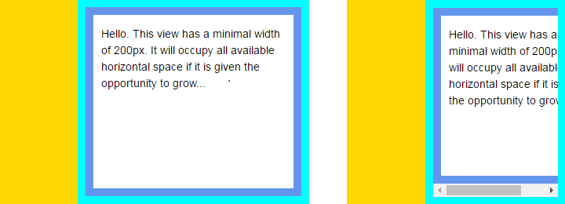

+++
categories = ["html", "css", "layout"]
date = "2016-06-17T06:23:13+02:00"
title = "HTML Layout without CSS calc()"
+++

We've been discussing various ways to build a UI where the display
is split into two `<div>`s. One has a fixed width, the other should
occupy 100% of the remaining horizontal space. If the browser window
gets too narrow, a scrollbar should appear on the flexible element.

One solution would be to set the widths explicitly:

* `width: 300px` on the first element
* `width: calc(100%-300px)` on the second element

I did not like the idea, since this requires that the second element
needs to know how wide the first element is, in order to write the
`calc()` property (i.e. 300 pixels). I'd rather have the browser
figure this out for me:



Here is the solution I've come up with:

```html
<!DOCTYPE html>
<html>
  <head>
  </head>
  <body style="margin: 0;
               font-family: 'Open Sans', Arial, sans-serif;
               font-size: 14px; line-height: 1.5;" >
    <div id="root"
         style="display: flex; flex-direction: row;
                height: 100vh; background-color: cyan">
      
      <div id="panel"
           style="flex-basis: 100px; flex-grow: 0; flex-shrink: 0;
                  background-color: gold;">
      </div>
      
      <div id="surface"
           style="flex-grow: 1; flex-shrink: 1;
                  overflow-x: auto;
                  display: flex; flex-direction: row;
                  margin: 10px; background-color: cornflowerblue;">
        
        <div id="view"
             style="min-width: 200px;
                    margin: 10px; background-color: white;">
          <p style="padding-left: 10px; padding-right: 10px;">
            Hello. This view has a minimal width of 200px. It will occupy all available
            horizontal space if it is given the opportunity to grow...
          </p>
        </div>
      </div>        
    </div>
  </body>
</html>
```

## Explanation

A root specifies that its children should be laid out using the
[flex](https://developer.mozilla.org/en/docs/Web/CSS/flex) model,
displaying both inner `<div>` side by side:

* The left **panel** sets its width using `flex-basis: 100px` and
  explicitly disables any growing or shrinking, making it fixed
  width.
* The right **surface** does not set its width; it also specifies
  that it may both _grow_ and _shrink_. The `overflow-x: auto`
  ensures that a horizontal scrollbar will be added if the content
  no longer fits in the available space.

The **surface** contains an element which may not become too narrow.
Its minimal width has been set to 200px. As soon as the **surface**
gets below 210px (minimum width + left margin of **view**) a
scrollbar appears.
