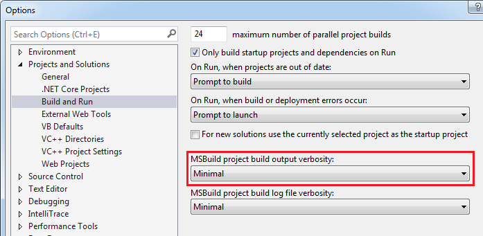

+++
categories = ["Build"]
date = "2016-12-06T06:30:32+01:00"
title = "Resolving MSB3247 - msbuild found conflicts between versions"
+++

While moving our Lydia project PCL to .NET Standard, I came across msbuild
warning MSB3247:

> MSB3247: Found conflicts between different versions of the same dependent assembly

The warning hinted that by setting the msbuild verbosity to _detailed_ I
would get more information on the conflicting assemblies.

As often, [stackoverflow](http://stackoverflow.com/questions/1871073/resolving-msb3247-found-conflicts-between-different-versions-of-the-same-depen)
provided the answer. In Visual Studio 2015, the setting can be found under _Tools_ >
_Options_:

Change _Minimal_ to _Diagnostics_ and rebuild. Then search for the warning
in the (very verbose) output.

In my case, a project was referencing an
assembly built for .NET Standard 1.3 while itself being configured for
.NET Standard 1.1. I updated the project and now the build is happy
again.
