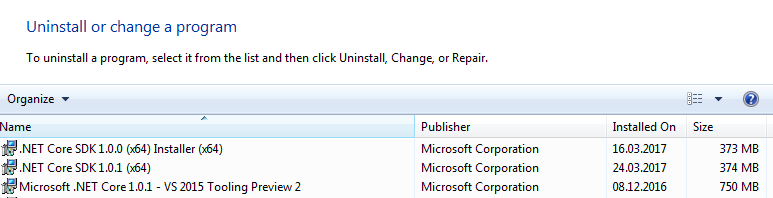

+++
categories = ["c#", "core", "vs2017"]
date = "2017-03-24T06:37:19+01:00"
title = "Getting xUnit tests to work in Visual Studio 2017 with .NET Core"
+++

While moving away from our Visual Studio 2015 _.NET Standard projects_
(defined as `*.csproj` + `project.json`) to Visual Studio 2017, I lost
all the tests from the **Test Explorer** window.

Our test projects and class libraries have all been moved to the new
`*.csproj` format, which looks like this:

```xml
<Project Sdk="Microsoft.NET.Sdk">
  <PropertyGroup>
    <TargetFramework>netcoreapp1.1</TargetFramework>
    <Authors>Pierre Arnaud</Authors>
    <Company>Epsitec</Company>
    <Product>Tests.Epsitec.Collections</Product>
    <Description />
    <Copyright>Copyright © 2014-2017</Copyright>
    <PackageId>Tests.Epsitec.Collections</PackageId>
  </PropertyGroup>

  <ItemGroup>
    <PackageReference Include="Microsoft.NET.Test.Sdk" Version="15.0.0" />
    <PackageReference Include="xunit" Version="2.2.0" />
    <PackageReference Include="xunit.runner.visualstudio" Version="2.2.0" />
  </ItemGroup>

  <ItemGroup>
    <ProjectReference Include="..\src\Epsitec.Collections.csproj"/>
  </ItemGroup>

  <ItemGroup>
    <Service Include="{82a7f48d-3b50-4b1e-b82e-3ada8210c358}" />
  </ItemGroup>
</Project>
```

After building the solution, I expected to find my tests in Visual
Studio 2017 _Test Explorer_ window. But it remained empty. However,
I found the tests in the _Test Runner_ window provided by CodeRush.

Somehow, CodeRush was finding the tests. Trying to run them did not
produce any visible result.

## Remove previous SDK previews

I dropped to the command line and tried to [create an xUnit test project](https://docs.microsoft.com/en-us/dotnet/articles/core/testing/unit-testing-with-dotnet-test)
from scratch.

The first command, `dotnet new classlib`, failed immediately. Hah!
Calling `dotnet --version` showed that I was not using the latest
version (it should have displayed `1.0.1`). Digging into my system,
I found out that I had several previews installed, and that somehow
they conflicted with my configuration:

* `C:\Program Files (x86)\dotnet\...` &rarr; contained only outdated
  x86 versions.
* `C:\Program Files\dotnet\sdk\...` &rarr; contained multiple preview
  SDKs.

I removed the SDKs from the control panel and only kept these:



I also manually removed any leftovers in `C:\Program Files\dotnet\sdk`
to keep just the stable ones, `1.0.0` and `1.0.1`.

After this clean up, `dotnet new classlib` worked, as did all the
other commands, and when executing `dotnet test`, my tests did
execute.

## Visual Studio 2017 does not like having a mess in your SDKs

Apparently, this also had a direct impact on Visual Studio 2017.
After I removed all the obsoleted previews of the .NET Core SDK,
my tests showed up in **Test Explorer** and I was able to run
them.

