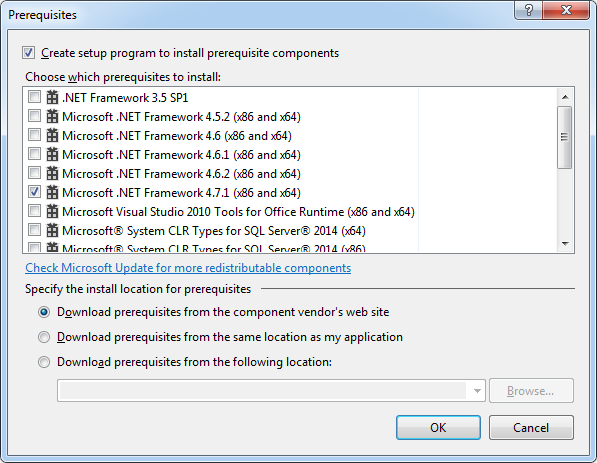

+++
categories = ["dotnet", "vs2017"]
date = "2017-11-14T20:55:39+01:00"
title = "ClickOnce with Visual Studio 2017 and .NET 4.7.1"
+++

We upgraded an internal tool, deployed using ClickOnce,
to .NET 4.7.1 (`net471`). When using the _Publish_ option
in Visual Studio 2017, the prerequisites don't provide an
option for `.NET 4.7.1`.

## Installing the prerequisites manually

Before starting, make sure you have the [Microsoft Framework 4.7.1 Developer Pack](https://www.microsoft.com/en-us/download/details.aspx?id=56119) installed on your machine.

Then:

* Open `C:\Program Files (x86)\Microsoft Visual Studio 14.0\SDK\Bootstrapper\Packages`.
* Copy `DotNetFX471` over to `C:\Program Files (x86)\Microsoft SDKs\ClickOnce Bootstrapper\Packages`.

That's all. Start Visual Studio 2017 and voilà, you should now see the prerequisite **Microsoft .NET Framework 4.7.1 (x86 and x64)** in the list:

See also [.NET Framework deployment guide for developers](https://docs.microsoft.com/en-us/dotnet/framework/deployment/deployment-guide-for-developers).
