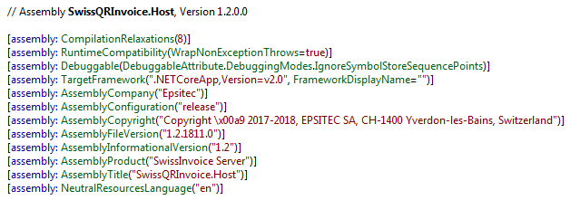
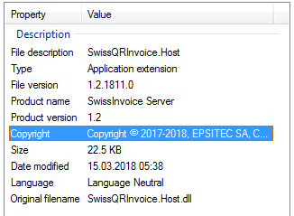

+++
categories = ["core", "vs2017"]
date = "2018-03-15T05:42:22+01:00"
title = "Using Directory.Build.props with .NET Core 2"
+++

The build system automatically includes the first `Directory.Build.props` file it finds in one of the project's parent folders, which makes it fairly easy to maintain various assembly attributes globally, at the solution level.

See [Customize your build](https://docs.microsoft.com/en-us/visualstudio/msbuild/customize-your-build) in Microsoft documentation.

## Example of a Directory.Build.props file

Here is an example of such a file:

```xml
<Project>
  <PropertyGroup>
    <Version>1.2</Version>
    <FileVersion>1.2.1811.0</FileVersion>
    <Product>SwissInvoice Server</Product>
    <Company>Epsitec</Company>
    <Copyright>Copyright © 2017-2018, EPSITEC SA, CH-1400 Yverdon-les-Bains, Switzerland</Copyright>
    <NeutralLanguage>en</NeutralLanguage>
  </PropertyGroup>
</Project>
```

See this [StackOverflow answer](https://stackoverflow.com/a/42143079/4597) for a list of supported properties.

## Generated Assembly

Opening one of the assemblies built with this `Directory.Build.props` settings with a tool like _Reflector_ confirms that the build process produced the expected assembly level attributes:



## Explorer File Properties

The _Details_ tab of the file properties now contains the expected properties:


