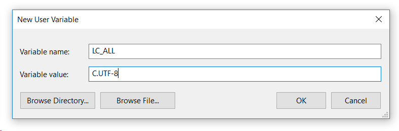

+++
categories = ["git"]
date = "2018-06-07T07:52:41+02:00"
title = "Configuring Windows for proper UTF-8 output with git"

+++

I am using `cmder` (based on `conemu`) as my console on Windows 10.
When working with `git log` I have to display messages which contain
UTF-8 encoded text. By default, the console does not properly display
the text:

- `è` gets displayed as `<C3><A8>`
- `é` gets displayed as `<C3><A9>`
- etc.

In order to have git properly render UTF-8 encoded texts, you have
to set an environment variable:

```cmd
set LC_ALL=C.UTF-8
```

# Make the change permanent

To make the change permanent, set the environment variable directly
using the _Edit environment variables for your account_ settings in
Windows:


