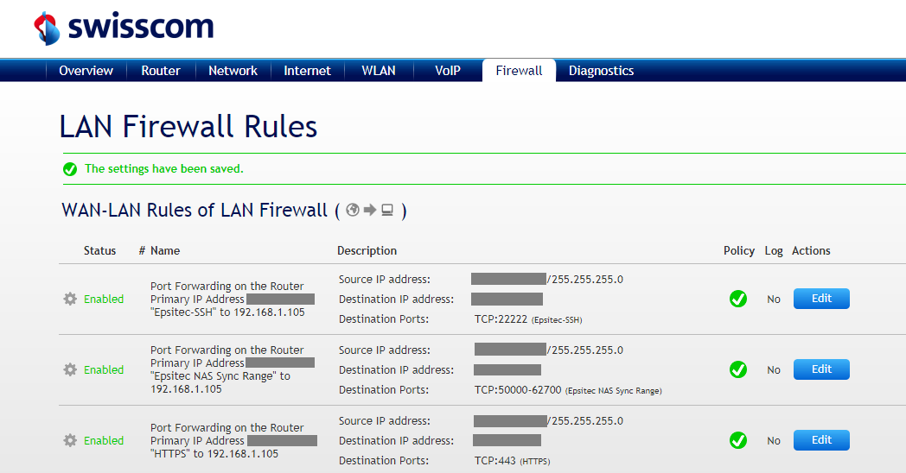

+++
categories = ["tools", "qnap"]
date = "2019-02-27T06:29:09+01:00"
title = "Solving the QNAP Snapshot Replica failure"
+++

At our office, we run a QNAP NAS and we have set up replication thanks
to _Snapshot Replica_ in Storage & Snapshots. Replicating volumes works
fine as long as we are targeting another QNAP located in the same network
as the initiator.

## Replicating off-site

Replicating to an off-site target QNAP requires some NAT configuration on
the target side. In order for the _Snapshot Replica_ to work, you have to
open multiple ports on the router, so that the target QNAP can be reached:

* `22` for the `SSH` connection.
* `50000` &ndash; `62700` for the replication traffic.

as documented on [QNAP's knowledge base](https://www.qnap.com/en/how-to/faq/article/why-are-snapshots-or-snapshot-replication-jobs-not-working-properly/).

This has been working until December 2018. Then, somehow, replications started
to fail and time out without any useful information; the laconic error message
returned was just **Session Timeout**. Trying to create a new replication job
failed while testing the connection, returning the same session timeout error.

## Help from the desk

I contacted the support team at QNAP and after sending in the logs of both
devices, and having the case escalated to level-3, I finally received the
answer: the snapshot replica also needs to be able to access the target QNAP
through HTTPS, so port `443` must be opened too.

## Configuring the NAT so that it works

So the secret for off-site _Snapshot Replica_ with two QNAP devices is to
open following ports:

* `22` for the `SSH` connection (can be mapped to another port).
* `443` for the `HTTPS` access.
* `50000` &ndash; `62700` for the replication traffic.

Obviously, you don't want to have these ports publicly accessible, as `22`
and `443` are targeted by numerous bots out there, trying to find craks in
your armor, and trying to guess your passwords to get in...

## Tightening the Firewall Rules

I am using a Swisscom router at the office where the target QNAP is located.
I tightened the security by setting a source IP range for the port forwarding,
so that only traffic issued by the source QNAP's network would be forwarded:

For this to work, the _Firewall_ has to be configured to _Custom_ in the
_Basic Settings_ control panel, otherwise the rules will show up, but will
not be honored and any incoming traffic will be routed to the QNAP.
