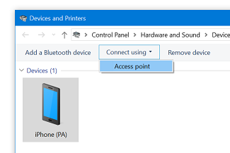

+++
categories = ["tips"]
date = "2020-01-21T06:53:13+01:00"
title = "Wifi Connected, No Internet"
+++

My laptop updated to Windows 10, version 1903 last night. Today, I was expecting
to work in the train, all day long, using my iPhone's shared Wifi connection.
After connecting my laptop to my iPhone's Wifi, I consistently got this message,
even after rebooting both devices:

> Connected, no Internet

## Solution (short term)

I never tried connecting to my iPhone over Bluetooth. So this was an opportunity
for me to experiment with it. After pairing the laptop with the phone, I was able
to _Connect using Access point_ and look out for solutions on how to solve the
wifi problem.



## Solution (long term)

I finally applied these commands, and it solved the problem:

```cmd
netsh winsock reset
netsh int ip reset
ipconfig /release
ipconfig /renew
ipconfig /flushdns
```
