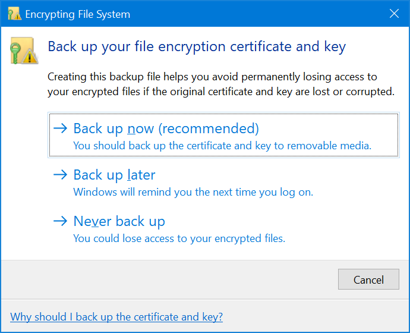
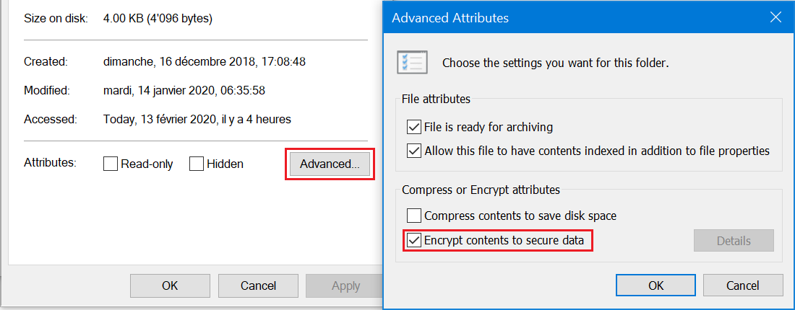

+++
categories = ["windows"]
date = "2020-02-13T10:00:00+01:00"
title = "Backup up your file encryption certificate and keys popping up"
+++

If, for some reason, you get a Windows 10 notification informing you that you should _back up your file encryption certificate and keys_, then this does not necessarily mean that you have a malware at work on your system, as some messages on Internet imply.



This only means that your system contains encrypted files. You can identify them using the _advanced properties_ in Windows Explorer:



Finding which files are encrypted on your disk is easy, with the `cipher` command. Simply run:

```bat
cipher /U /N /H
```

from a commande prompt and it list all encypted files on your file system.

## Cancel encryption and move on...

If you, like me, didn't intend to use encrypted files, then you now know where to find them and can easily deactivate their encryption, thus making the request to back up the file encryption certificate and key moot.
