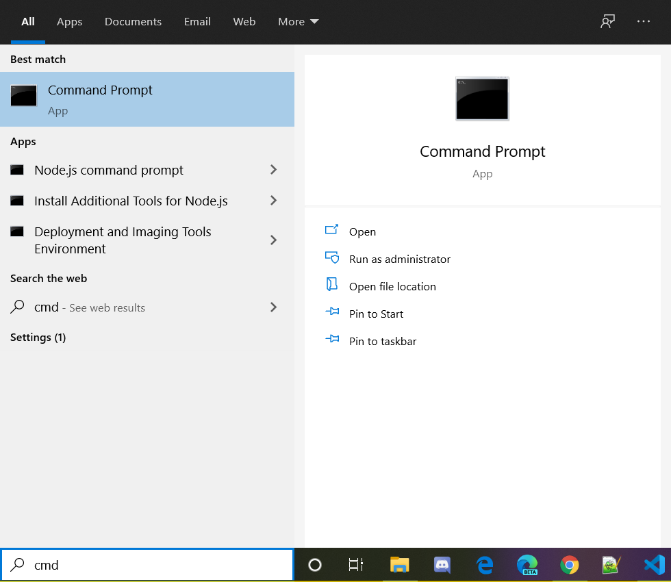

+++
categories = ["tools"]
date = "2020-02-06T06:00:00+01:00"
title = "Windows 10 Search Box shows not results"
+++

Hitting the Windows key and typing ahead usually shows some search results:

However, this morning, the search results looked just like a black box.
The whole start menu remained black, without any hint of it searching
for anything.

## PowerShell Script to the Rescue

I tried rebooting the machine, tried fixing search issues with the
troubleshooter. Nothing helped. Finally, I found a PowerShell script
in [Microsoft's Knowledge Base](https://support.microsoft.com/en-us/help/4520146/fix-problems-in-windows-search)
which did the trick.

Run the script and accept its requests to run from an untrusted
source, allow it to relaunch elevated, etc. and at the end, my
_Type here to search_ experience was back and working.
