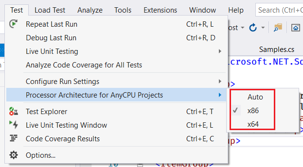

+++
categories = ["c#"]
date =  "2020-09-09T04:30:00+01:00"
title = "SkiaSharp Throws BadImageFormatException in Unit Tests"
+++

I recently upgraded Visual Studio 2019, and I was puzzled as all tests which were
using `SkiaSharp` would crash with a `BadImagFormatException`:

```
System.TypeInitializationException : The type initializer for 'SkiaSharp.SKImageInfo' threw an exception.
    ---- System.BadImageFormatException : An attempt was made to load a program with an incorrect format.
```

My build settings were all set to **Any CPU** and I did not tick the checkbox **Prefer 32-bit**.
I somehow suspected that the tests were given an x86 library, so I tried adding following
to the *.csproj file:

```xml
<ShouldIncludeNativeSkiaSharp>True</ShouldIncludeNativeSkiaSharp>
<PreferredNativeSkiaSharp>x64</PreferredNativeSkiaSharp>
```

as suggested in this [SkiaSharp issue on the topic](https://github.com/mono/SkiaSharp/issues/513). It
did not help.

## Select the correct CPU architecture for your Visual Studio Tests

Microsoft's article [on running tests as a 64-bit process](https://docs.microsoft.com/en-us/visualstudio/test/run-a-unit-test-as-a-64-bit-process?view=vs-2019)
pointed me to the correct solution. Somehow, the default setting I was using for the processor
architecture, when running my tests, changed after updating Visual Studio.



Setting the _Processor Architecture for AnyCPU Projects_ back to **Auto** solved the issue.
