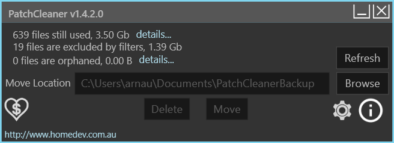

+++
categories = ["windows", "tools"]
date = "2021-05-11T16:00:00+02:00"
title = "Cleaning up the Windows System Installer folder"
+++

The disk of a colleague's Windows 10 laptop was getting very full, and she
was asked me to look into it. She had already cleaned up unused files manually,
ran the _Disk Cleanup_ command, yet she had barely any room left on her 100GB
drive.

## WinDirStat to the rescue

When tracking down disk use on Windows, nothing compares to [WinDirStat Portable](https://www.heise.de/download/product/windirstat-15041/download).
I ran it on drive `C:` and it was quickly apparent that the culprit was the
hidden system folder `C:\Windows\Intaller` which contained about 60GB of `*.msi`
and `*.msp` files.

## Cleaning up the Installer folder

This folder is under the control of the operating system installer. Apparently,
when system updates fail, it can fill up with orphaned installer files. Manually
deleting (or moving) the protected files would have been an option, but it had
been a long day, and I did not want to nuke the laptop...

Fortunately, John Crawford wrote the nifty [PatchCleaner](https://www.homedev.com.au/Free/PatchCleaner) tool. After scanning the disk for a while, it should display something like this on a healthy system:

On my colleague's laptop, there were indeed tons of orphaned files, over
50GB of them. I decided to take the safe route and moved them to another
disk.

All-in-all, the experience was very satisfying! Great tool.
The only issue is its lack of Authenticode signature, which makes
Windows emit a warning when **PatchCleaner** needs to elevate itself.
