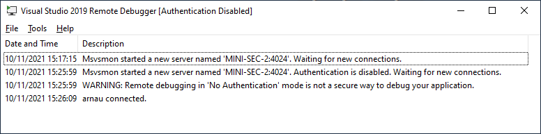
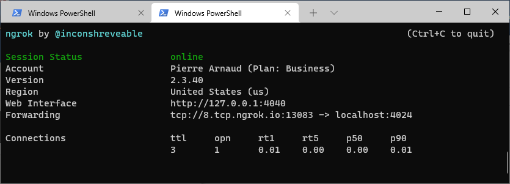
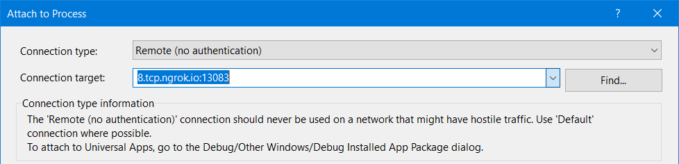

+++
categories = ["windows", "tools", "debugging"]
date = "2021-11-11T06:00:00+02:00"
title = "Remote Debugging with Visual Studio and ngrok"
+++

I had an issue in production on some C# application, which required me to use the
[Visual Studio Remote Debugging Tools](https://download.visualstudio.microsoft.com/download/pr/4f8401ac-6f57-4ae6-a8d7-d26521b31b37/bb1765fdb9b3dcf0454916d58652b535daa163cf00e426e2fdd8c8b7009180c0/VS_RemoteTools.exe),
which include the handy _Visual Studio 2019 Remote Debugger_.

When the remote debugger starts, it tells us on which address it is waiting for connections. In my case, it was on port `4024` of the machine where I was running into trouble.

Since the PC was sitting behind a NAT and a firewall, I could not reach it from home without setting up a VPN. I wondered how I could access the running `msvsmon.exe` without having to go through the deployment of a VPN or an SSH tunnel.



## Create a TCP tunnel with ngrok

I had been using `ngrok` to make some HTTP service sitting behind a NAT available from the outside world, but I did not realize that this nifty tool can also be used to make any TCP port visible publicly.

Just [install ngrok for Windows](https://dashboard.ngrok.com/get-started/setup) on the machine where `msvsmon.exe` is running. Then open a command prompt and make the TCP port visible from outside:

```cmd
./ngrok tcp 4024
```

The tool displays the forwaring address (for instance `8.tcp.ngrok.io:13083`) mapped to the TCP port `4024`.  
It looks like this:



## Connect Visual Studio to msvsmon over ngrok

Connecting **Visual Studio** to the remote debugger can the be done as usual, by using the forwarding address provided by `ngrok`.

Use command _Debug_ > _Attach to Process_ then select the _Remote (no authentication)_ connection type and enter the forwarding address into the _Connection target_:



After a few seconds, the available processes should show up and you can attach to the culprit and debug it.
