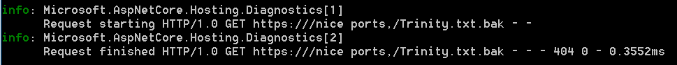

+++
categories = ["mysteries"]
date = "2021-11-22T17:00:00+02:00"
title = "Nice Ports, Trinity? Huh?"
+++

I was debugging an ASP.NET Core 6 service the other day, when I
noticed this strange access in its log:

`nice ports,/Trinity.txt.bak` - what the hell is this thing!? And the request comes from _inside_ my network. Alarm bells started to ring in my head. Did I face an intrusion?

## I am not alone...

Apparently, I am not the only person seeing Trinity doing some probing in my home network, as some searching revealed. Here is what I found on a UniFi forum: **["http:///nice ports,/Trinity.txt.bak" requests from UDM-Pro](https://community.ui.com/questions/http-nice-ports-Trinity-txt-bak-requests-from-UDM-Pro/f7a8b2a8-ae99-4bcc-87f3-c53aaa60ba15)**. So, apparently, I wasn't being sucked into the Matrix yet.

## This is just nmap scanning the network

This strange activity does indeed originate from within the UniFi Dream Machine (UDM) I use as a bridge between my private network and the router provided by my ISP. Apparently, UDM relies on some [nmap probing](https://seclists.org/nmap-dev/2006/q2/162) to check what kind of server and services are running on my network.

Taken from the [Nmap Development mailing list archives (8 May 2006)](https://seclists.org/nmap-dev/2006/q2/162):

> The next question is what the text string should be.
`/0wned/by/Nmap.txt` would be amusing for a few hours until I get
flooded by hate mail from admins who don't know what is going on and
think I hacked their server :).  A short non-threatening message like
`"/nice/ports"` or `"/Trinity/was/here"` might be OK :)

So next time I see some weirdo activity in my network, I'll first check to see if this is my UDM doing tricks on me.
