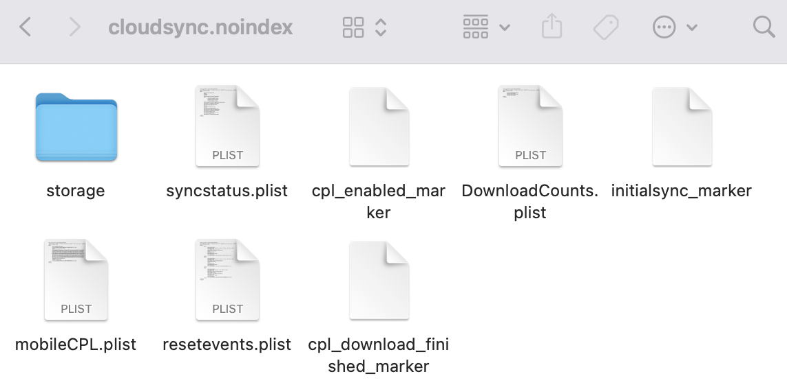

+++
categories = ["mac"]
date = "2021-12-27T17:30:00+01:00"
title = "Photos (on Mac) isn't seeing my new photos"
+++

I have a relatively large collection of photos accumulated over the
years and I recently moved my `*.photoslibrary` file to a larger external (2TB) storage drive.

I also updated to the latest macOS recently, moved the photos to another laptop and started wondering why the pictures I took did not make it into the photo library anymore. They showed up in **iCloud** as I could see them online, but my Mac would not download them.

## Fixing Photos iCloud Synchronization

The obvious step is &ndash; of course &ndash; to make sure that the corresponding option is active in **Photos** iCloud settings. If this does not help, then you might have a **corrupted index** in your library.

## Removing the corrupted index

First, quit **Photos**, so that the photo library can be opened and manipulated without interference.

Then, in the **Finder**, right-click on the **photo library** file and select _Show Package Contents_, then navigate down `resources` > `cpl` > `cloudsync.noindex` and send all its contents to the recycle bin.

Open **Photos** and follow the instructions to enable downloading of the whole photo library from iCloud. Photos already in your local library won't be downloaded again, and only the new photos will show up. From now on, everything should run smoothly.
