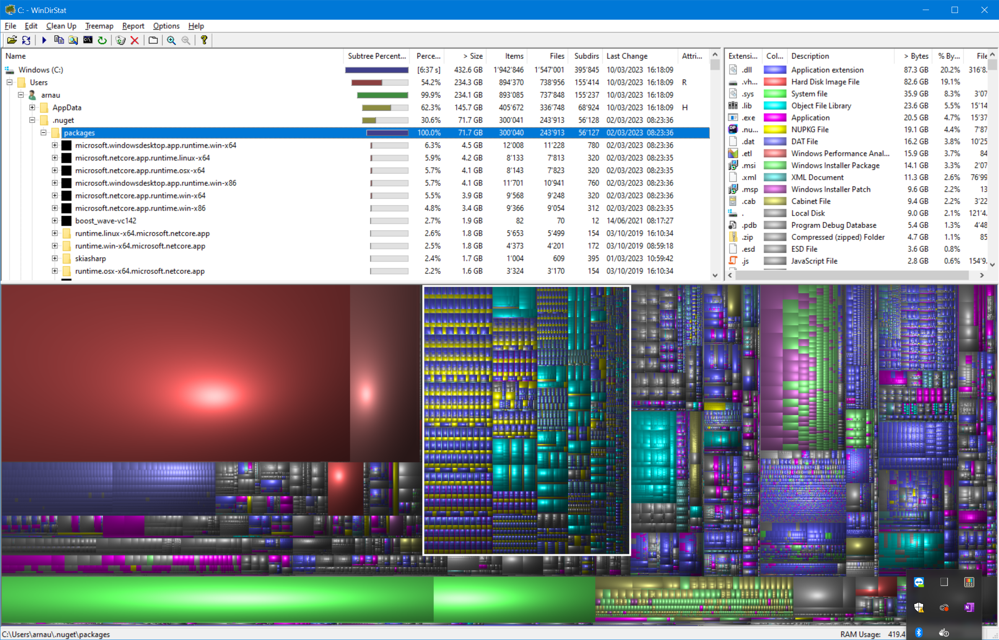

+++
categories = ["code"]
date = "2023-03-13T10:03:00+01:00"
title = "Nuget packages are eating all my disk space"
+++

The `C:\` disk drive on my laptop filled up without me installing any new
tools for months. Digging into the toolchest, I pointed WinDirStat at the
drive to find out what was going on:



I was very surprised to discover that more than 70GB of disk space was being
used by Nuget. See that `AppData\.nuget\packages` folder there? It's Nuget's
cache. Every time I compile some source code and a new version of a given
package is referenced, it gets copied over there. Over the years, this can
pile up to hundreds of gigabytes.

## Cleaning up Nuget cache

Since `nuget` is now part of the global .NET tools, you can simply execute
the following commande to clear all cache folders used by Nuget:

```
dotnet nuget locals all -c
```

Voilà. The folder is now empty and it will start to fill up again, slowly,
whenever I compile new code.
