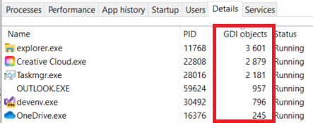

+++
categories = ["windows"]
date = "2024-01-25T16:45:00+01:00"
title = "Explorer gets very slow on a fast machine (GDI exhaustion)"
+++

On one of my computers, I've observed that after some time, every
window of every software gets slower and slower when redrawing.
This especially happens after working with a program which is
known to create lots of UI elements.

The slow-down most struck me with Windows **Explorer**. Simply opening
a new window could take several seconds until it became visible,
and its content was very slow to appear. Or **Outlook** would freeze
for seconds, without apparent reason.

And yet, I have plenty of memory available, my disks are blazingly
fast, and my CPU has 32 logical cores. Even **Task Manager** became
slow when repainting.

## Slow painting, why?

I've been living with this slow painting, which gets worse and worse
over the time, until I reboot the computer and then everything gets
fast again.

Until the other day, when I realized that Windows sets a quota on
its GDI Handles!

```
HKEY_LOCAL_MACHINE
  \SOFTWARE
    \WOW6432Node
      \Microsoft
        \Windows NT
          \CurrentVersion
            \Windows
              GDIProcessHandleQuota
```

The documentation on [GDI Objects](https://learn.microsoft.com/en-us/windows/win32/sysinfo/gdi-objects)
says that the `GDIProcessHandleQuota` limits the number of GDI
handles to objects.

By default, it seems to be set to 10,000 (that is ten thousand
GDI objects or handles).

Now look at this information in Task Manager:



The five first processes in the list sum up to over 10,000 GDI
objects. By increasing the `GDIProcessHandleQuota` to 20,000
my systems seems to stay responsive.

> An article found on [M-Files support](https://m-files.my.site.com/s/article/GDI-object-handle-limit-might-fill-up-causing-explorer-exe-to-misfunction-or-crash)
tends to confirm that exceeding 10,000 GDI objects can cause Windows
to misbehave.

So I now have to test this for a few days, in order to decide if
this is some IT placebo effect, or if the there is a difference.
