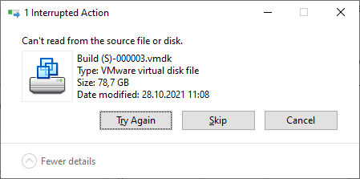
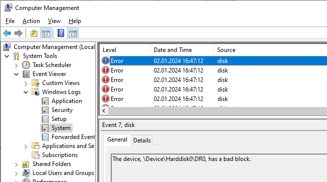

+++
categories = ["tools"]
date = "2024-01-02T16:30:00+01:00"
title = "Copying a file with bad blocks"
+++

I needed to copy some huge files, used by VMware Workstation, to a new machine.
I used the Windows Explorer and simply dragged the folder to the new destination.
However, after a few minutes the copy aborted with following error:



I launched the **Computer Management** console and opened **Windows Logs/System**
under the **Event Viewer** node. Looking at the event log confirmed that my disk
has some bad blocks:



I confirmed this by running `chkdsk /scan /r C:`, however, after rebooting and
attempting a repair, the error was still preventing me from copying the huge file.

## Force Copy to the rescue

Looking for a solution, I came across an [old post from Davor Josipovic (June 2013)](https://www.davor.josipovic.be/blog/2013/06/02/ignoring-device-io-errors-during-copy-with-powershell/).
Davor had written a PowerShell script which tries to copy a file,
skipping the bad blocks and replacing them with zeroes if multiple
read attempts don't succeed.

I downloaded the [Force-Copy.ps1](https://github.com/DavorJ/PS-ForceCopy/blob/master/Force-Copy.ps1)
file and copied it to my `C:\Tools` folder. As explained by Davor,
trying to execute it directly would fail with following message:

```
C:\Tools\Force-Copy.ps1 : File C:\Tools\Force-Copy.ps1 cannot be loaded.
The file C:\Tools\Force-Copy.ps1 is not digitally signed. You cannot
run this script on the current system. For more information about running
scripts and setting execution policy, see about_Execution_Policies at
https:/go.microsoft.com/fwlink/?LinkID=135170.
```

However, rather than changing the _execution policy_ globally, I
prefer to unblock just that file:

```cmd
Unblock-File -Path C:\Tools\Force-Copy.ps1
```

## Copying the damaged file

Now that I unblocked the file without changing the _execution policy_ of my system,
I can run the script to copy the damaged file:

```cmd
C:\Tools\Force-Copy.ps1 \
  -SourceFilePath "Build (S)-000003.vmdk" \
  -DestinationFilePath "D:\VMs\Build (S)-000003.vmdk"
```

I tried using the
`-BufferSize 33554432 -BufferGranularSize 4096` arguments to
speed up the whole operation by a factor of 5, however the copy
did not work as advertised and produced a hole of 32MB in the file, rather than discarding _just 4096 bytes_.

> The `-BufferSize 33554432` argument tells the script to attempt to read
chunks of 32MB each, and `-BufferGranularSize 4096` ensures that the
reads will be done with the minimal cluster size once when an error
is encountered. This makes the whole process much faster.
