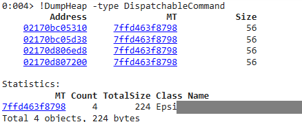
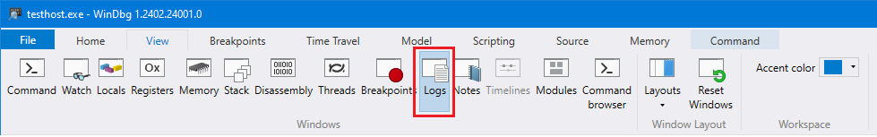

+++
categories = ["debug"]
date = "2024-06-22T13:00:00+01:00"
title = "Using WinDbg to find .NET object references"
+++

I was testing some code which relied on `WeakReference` to keep track of objects.
My test called `GC.Collect()` in order to force the garbage collector to run and
my objects to be recycled. However, for some reason which was not clear to me, a
few objects were not collected.

I remembered vaguely Tess Ferrandez explaining how we could leverage an `sos` plug-in
for WinDbg to explore the GC roots. It might have been the 2022 talk given at NDC
in London ([Advanced .NET Debugging session](https://www.youtube.com/watch?v=yA-b-V_9N_E))
or some blog post she wrote...

It has been years since I used WinDbg, so I had to rediscover the tool, which has
been signficantly improved over the past 20 years.

## Getting WinDbg

I headed over to Microsoft's documentation on how to [Install the Windows debugger](https://learn.microsoft.com/en-us/windows-hardware/drivers/debugger/)
and used the `winget` command line:

> winget install Microsoft.WinDbg

However, WinDbg alone is not enough. To inspect .NET code, you have to install a plugin
called `SOS.dll` (which now officially stands for [SOS debugging extension](https://learn.microsoft.com/en-us/dotnet/framework/tools/sos-dll-sos-debugging-extension)
but the old hats remember it as [Son of Strike](https://stackoverflow.com/questions/3572990/whats-the-story-behind-the-name-of-the-sos-son-of-strike-debugger-extension)).

Installing `SOS.dll` is best done automatically by WinDbg itself. See below...

## Attach to a process and load SOS.dll

As I wanted to debug some unit test running under Visual Studio test runner, I started my
test, which I had modified to loop forever in the test which I wanted to debug. I then
launched WinDbg and attached it to the test process `testhost.exe`.

To install and load SOS.dll I used following command:

> !analyze –v

which as a side-effect loads the most compatible `SOS.dll` from some Microsoft servers.
The [trick is explained in details here](https://www.atmosera.com/blog/automatically-load-the-right-sos-for-the-minidump/).

## Dumping the heap, looking for the culprit

In order to find all living instances of a type `Foo`, use the `DumpHeap` command:

> !DumpHeap -type Foo

WinDbg dumps a table with the Address and MT (method table) of every object.

Pick an _address_ (e.g. `02170bc05310`) and execute the `GCRoot` command:

> !GCRoot 02170bc05310

This displays all places where a reference to the specified object is being
held. From there, follow the references...

## Be patient

The first time I attached to the `testhost.exe` process, I thought that WinDbg had
gone unresponsive. Whatever command I tried, nothing happened. This is normal! Just
be patient, as WinDbg has to first download the symbols for all the modules it
discovered in the running process.

Only then does it make sense to try to load a source file and set some breakpoints.
Trying to set the breakpoints while the debugger is still working won't do anything
visible. So, watch out for the status indicator which tells you that WinDbg is still
working... and have a look at the logs (ribbon _View_ > _Logs_).

## Additional resources

- [Tess Ferrandez Debugging Scripts on GitHub](https://github.com/TessFerrandez/DebuggingScripts).
- [Tess Ferrandez Blog about DGML Graphs](https://www.tessferrandez.com/blog/2010/03/03/tool-for-generating-dgml-graphs.html)
